# TFT AI Coach System (Manual Execution)

## Concept

Build an AI advisor that watches your game and tells you what to do - like having a Challenger coach whispering in your ear. You manually execute the decisions, which lets you:

1. Validate the bot's decisions are actually good
2. Learn TFT strategy from the bot's reasoning
3. Build trust before ever automating

## System Architecture

```mermaid
flowchart LR
    subgraph capture [Screen Capture]
        HOTKEY[Press Hotkey]
        SCREEN[Screenshot]
    end
    
    subgraph extract [State Extraction]
        OCR[OCR + YOLO]
        JSON[Game State JSON]
    end
    
    subgraph brain [Decision Engine]
        ANALYZE[State Analyzer]
        DECIDE[Decision Logic]
        EXPLAIN[Reasoning Generator]
    end
    
    subgraph output [Output to You]
        API[WebSocket API]
        DASH[Dashboard UI]
        LOGS[Decision Logs]
    end
    
    HOTKEY --> SCREEN --> OCR --> JSON
    JSON --> ANALYZE --> DECIDE --> EXPLAIN
    EXPLAIN --> API --> DASH
    DASH --> LOGS
```



## Decision Log Output Format

Each decision sent to your dashboard will include:

```json
{
  "timestamp": "2026-02-03T14:32:05Z",
  "game_state_summary": {
    "stage": "3-2",
    "health": 78,
    "gold": 34,
    "level": 6,
    "board_size": 5,
    "bench_size": 3,
    "active_traits": ["Sorcerer 4", "Yordle 3"]
  },
  "analysis": {
    "economy_status": "healthy",
    "board_strength": "medium",
    "win_streak": 2,
    "position_in_lobby": "estimated 3rd-4th"
  },
  "decision": {
    "action": "BUY",
    "target": "Veigar in slot 2",
    "priority": "high",
    "reasoning": "Veigar completes 2-star, activates Sorcerer 6. Strong power spike for 3 gold."
  },
  "alternative_actions": [
    {"action": "LEVEL", "reasoning": "Could level to 7 for extra unit slot"},
    {"action": "SAVE", "reasoning": "Eco to 50 for interest"}
  ]
}
```

## Frontend Dashboard Integration

Your existing dashboard at [`frontend/src/pages/Dashboard.jsx`](frontend/src/pages/Dashboard.jsx) will get a new **Decision Log** panel:

```
+--------------------------------------------------+
|  TFT Bot Dashboard                               |
+--------------------------------------------------+
|  Game State        |  Decision Log               |
|  ---------------   |  -------------------------  |
|  Stage: 3-2        |  [14:32:05] HIGH PRIORITY   |
|  HP: 78            |  BUY Veigar (slot 2)        |
|  Gold: 34          |  > Completes 2-star         |
|  Level: 6          |  > Activates Sorcerer 6     |
|                    |                             |
|  Board: 5 units    |  [14:31:42] MEDIUM          |
|  Bench: 3 units    |  HOLD - save for interest   |
|                    |                             |
+--------------------------------------------------+
```

## Implementation Phases

### Phase 1: Fix State Extraction (Current Blocker)

Before any decisions can be made, we need accurate game state:

1. **Calibrate ROIs** - Fix screenshot regions to capture TFT correctly
2. **Verify OCR** - Ensure gold/HP/level/stage extraction works
3. **Add champion detection** - Template matching for shop, YOLO for board

### Phase 2: Decision Engine

Create the brain that analyzes state and outputs recommendations:

```
bot/
├── __init__.py
├── decision_engine.py    # Main orchestrator
├── analyzers/
│   ├── economy.py        # Gold management analysis
│   ├── board.py          # Board strength evaluation
│   └── shop.py           # Shop value analysis
├── strategies/
│   ├── base.py           # Strategy interface
│   ├── flex.py           # Flexible/adaptive play
│   └── reroll.py         # Reroll comps
└── decisions.py          # Decision output types
```

Decision types to support:

- `BUY <champion>` - Purchase from shop
- `SELL <champion>` - Sell from bench/board
- `LEVEL` - Buy XP
- `REROLL` - Refresh shop
- `POSITION <unit> <hex>` - Move unit
- `EQUIP <item> <champion>` - Put item on unit
- `HOLD` - Do nothing, save gold

### Phase 3: WebSocket Streaming to Frontend

Extend your existing [`state_extraction/api.py`](state_extraction/api.py) to stream decisions:

```python
# New endpoint: /ws/decisions
# Streams decision logs to frontend in real-time
```

### Phase 4: Dashboard Decision Log UI

Add a decision log component to your frontend:

```
frontend/src/components/
├── DecisionLog.jsx       # Decision log panel
├── DecisionCard.jsx      # Single decision display
└── DecisionLog.css       # Styling
```

Features:

- Live updates via WebSocket
- Color-coded priority (red = urgent, yellow = medium, green = low)
- Expandable reasoning for each decision
- History of past decisions

## Workflow When Playing

1. Play TFT normally
2. Press hotkey (`\`) to capture screenshot
3. Bot extracts game state -> analyzes -> decides
4. Decision appears on dashboard with reasoning
5. You manually execute (or ignore) the recommendation
6. Repeat

## Files to Create/Modify

| File | Purpose |

|------|---------|

| `bot/__init__.py` | Bot package |

| `bot/decision_engine.py` | Main decision orchestrator |

| `bot/analyzers/economy.py` | Gold/interest analysis |

| `bot/analyzers/board.py` | Board strength scoring |

| `bot/analyzers/shop.py` | Shop value evaluation |

| `bot/decisions.py` | Decision types and formatting |

| `state_extraction/api.py` | Add `/ws/decisions` endpoint |

| `frontend/src/components/DecisionLog.jsx` | Decision log UI |

| `frontend/src/pages/Dashboard.jsx` | Integrate decision log |

## Starting Simple

For v1 decision engine, start with basic rules:

1. **Always buy pairs** - If shop has a unit you have 1 of, buy it
2. **Don't break interest** - Stay above 10/20/30/40/50 gold thresholds
3. **Level at standard timings** - Level 5 at 2-5, level 6 at 3-2, etc.
4. **Sell 1-star non-pairs** - Clear bench of units with no upgrade path

This gets you a working system fast, then you can add smarter logic iteratively.