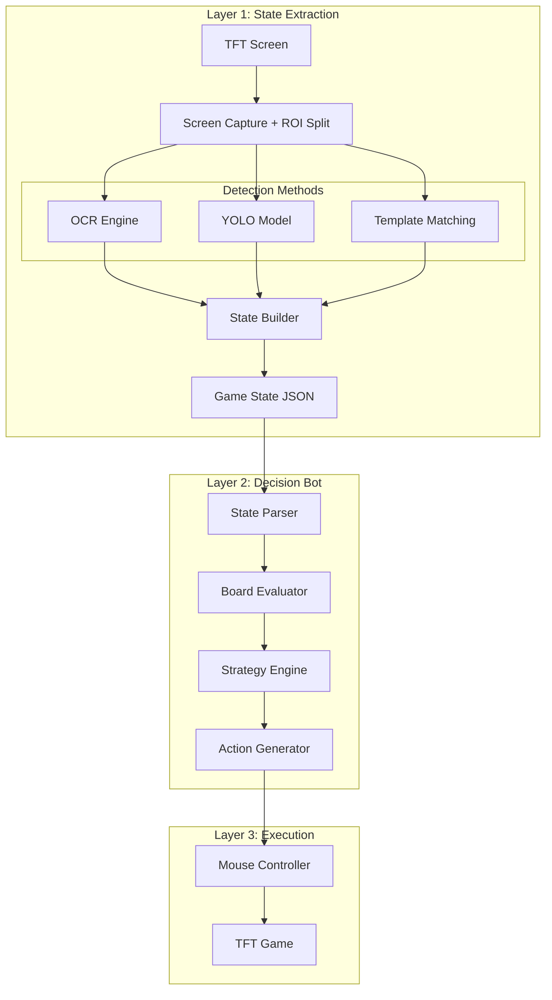

# TFT Bot Complete Architecture

## What You Already Have (Working)

Your codebase already has a solid foundation:

| Component | File | Status |
|-----------|------|--------|
| Screen Capture | [`state_extraction/capture.py`](state_extraction/capture.py) | Done (needs ROI calibration) |
| OCR Pipeline | [`state_extraction/ocr.py`](state_extraction/ocr.py) | Done (gold, HP, level, stage) |
| YOLO Detector | [`state_extraction/detector.py`](state_extraction/detector.py) | Framework done, needs model |
| State Builder | [`state_extraction/state_builder.py`](state_extraction/state_builder.py) | Done (combines into JSON) |
| API Server | [`state_extraction/api.py`](state_extraction/api.py) | Done (WebSocket streaming) |

## Full System Architecture



## Game State JSON Output

Your existing `GameState` class outputs this structure - this is what the bot consumes:

```json
{
  "timestamp": "2026-02-03T14:32:05Z",
  "stage": {"current": "3-2", "phase": "combat"},
  "player": {
    "health": 78,
    "gold": 34,
    "level": 6,
    "xp": {"current": 12, "required": 24}
  },
  "board": [
    {"slot": [2, 1], "champion": "Veigar", "star": 2, "items": ["Rabadon"]}
  ],
  "bench": [
    {"slot": 0, "champion": "Lulu", "star": 1, "items": []}
  ],
  "shop": [
    {"slot": 0, "champion": "Teemo", "cost": 3}
  ],
  "items": ["BF Sword", "Chain Vest"],
  "traits": [
    {"name": "Sorcerer", "count": 4, "tier": "gold"}
  ],
  "augments": ["Celestial Blessing", "Trade Sector"]
}
```

## Hybrid Detection Strategy (Recommended)

Instead of training YOLO for everything, use the right tool for each element:

| Element | Method | Why |
|---------|--------|-----|
| Gold, HP, Level, XP, Stage | **OCR** | Already working! Text extraction |
| Shop Champions | **Template Matching** | Fixed positions, use Riot splash art |
| Items | **Template Matching** | Fixed icons from Data Dragon |
| Board Champions | **YOLO** | Variable positions, need ML |
| Bench Champions | **YOLO** | Variable positions, need ML |
| Star Levels | **Template/Color** | Fixed star icons above units |
| Traits | **OCR + Icons** | Text names + icon matching |

This reduces YOLO training to just ~60 champion classes for board/bench detection.

## Implementation Plan

### Phase 1: Fix Screen Capture (Required First)

Create a calibration tool to align ROIs with your actual TFT window:

```python
# training/calibrate_roi.py
# Click 4 corners of TFT window -> auto-calculate all ROI offsets
```

### Phase 2: Template Matching for Shop/Items

Add template matcher to avoid YOLO training for fixed elements:

```python
# state_extraction/template_matcher.py
# Match champion splash arts in shop slots
# Match item icons in inventory
```

Champion icons available from Riot Data Dragon:
`https://ddragon.leagueoflegends.com/cdn/14.1.1/img/tft-champion/`

### Phase 3: YOLO Training (Board/Bench Only)

1. Capture 200-500 board/bench screenshots during real games
2. Annotate only champions using LabelImg (YOLO format)
3. Train YOLOv8n: `python training/train_yolo.py --action train`

### Phase 4: Decision Bot

Create the bot brain that consumes JSON and outputs actions:

```python
# bot/
#   decision_engine.py  - Main bot logic
#   evaluator.py        - Board strength evaluation  
#   strategies.py       - Comp strategies (reroll, slow roll, fast 8)
#   actions.py          - Click/mouse actions
```

Decision flow:
1. Parse JSON game state
2. Evaluate current board strength and economy
3. Select strategy based on stage/HP/gold
4. Generate prioritized actions (buy, sell, position, level, reroll)
5. Execute via mouse controller

### Phase 5: Continuous Loop

```python
while game_running:
    # 1. Capture and extract state
    state = state_builder.build_state_full()
    
    # 2. Bot decides action
    action = bot.decide(state)
    
    # 3. Execute action
    executor.perform(action)
    
    # 4. Wait for game response
    time.sleep(0.5)
```

## Files to Create

| File | Purpose |
|------|---------|
| `training/calibrate_roi.py` | Visual ROI alignment tool |
| `state_extraction/template_matcher.py` | Shop/item template matching |
| `bot/__init__.py` | Bot package |
| `bot/decision_engine.py` | Main decision logic |
| `bot/evaluator.py` | Board/economy evaluation |
| `bot/actions.py` | Mouse click executor |

## Recommended Order

1. **Fix ROI calibration** - Nothing works until screenshots capture TFT correctly
2. **Add template matching** - Quick win for shop/items without ML training
3. **Train YOLO for board/bench** - The hardest part, but scoped down
4. **Build decision bot** - Start with simple rules, iterate

## Quick Start After Plan Approval

```bash
# Step 1: Run calibration tool (will create)
python training/calibrate_roi.py

# Step 2: Test OCR extraction
python -m state_extraction.ocr

# Step 3: Capture training data during a real game
python training/capture_training_data.py

# Step 4: Annotate with LabelImg
labelImg screenshots/board/
```