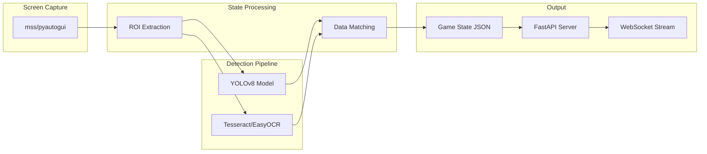

# TFT State Extraction System (Layer 2)

Build a computer vision pipeline that reads the TFT game screen and extracts all game state into JSON format, using YOLO for unit/item detection and OCR for text elements.

## Architecture



## Game State JSON Schema

```json
{
  "timestamp": "2026-01-27T14:32:05Z",
  "stage": { "current": "3-2", "phase": "combat" },
  "player": {
    "health": 78,
    "gold": 34,
    "level": 6,
    "xp": { "current": 12, "required": 24 }
  },
  "board": [
    { "slot": [2, 1], "champion": "Veigar", "star": 2, "items": ["Rabadon"] }
  ],
  "bench": [
    { "slot": 0, "champion": "Lulu", "star": 1, "items": [] }
  ],
  "shop": [
    { "slot": 0, "champion": "Teemo", "cost": 3 }
  ],
  "items": ["BF Sword", "Chain Vest"],
  "augments": ["Celestial Blessing", "Trade Sector"]
}
```

## File Structure

```
tft bot/
├── state_extraction/
│   ├── __init__.py
│   ├── capture.py          # Screen capture + ROI definitions
│   ├── detector.py         # YOLO model wrapper
│   ├── ocr.py              # OCR for text extraction
│   ├── state_builder.py    # Combines detections into JSON
│   ├── api.py              # FastAPI + WebSocket server
│   └── config.py           # Screen regions, thresholds
├── models/
│   └── tft_yolo.pt         # Fine-tuned YOLO weights (after training)
├── training/
│   ├── capture_training_data.py
│   ├── label_data.py
│   └── train_yolo.py
└── requirements.txt
```

## Implementation Phases

### Phase 1: Screen Capture + ROI System

- Use `mss` for fast screen capture
- Define precise regions of interest for: board (hex grid), bench, shop, gold/HP/level HUD, item inventory
- Build calibration tool to adjust ROI for different resolutions

### Phase 2: OCR Pipeline

- Extract gold, HP, level, XP, stage using EasyOCR or Tesseract
- Pre-process images (threshold, crop, resize) for accuracy
- Map stage text to structured format ("3-2" -> combat phase)

### Phase 3: YOLO Training Data Collection

- Build a screenshot capture tool during gameplay
- Create annotation script using labelImg or Roboflow
- Target classes: ~60 champions, ~40 items, star indicators, traits

### Phase 4: YOLO Model Training

- Start with YOLOv8n (nano) for speed
- Fine-tune on TFT-specific dataset
- Validate detection accuracy on held-out screenshots

### Phase 5: State Builder + API

- Combine YOLO detections with OCR results
- Match detected champions/items to `tft_data.json` for validation
- FastAPI server with WebSocket for real-time streaming
- Endpoint: `GET /state` and `WS /state/stream`

### Phase 6: Frontend Integration

- Connect Dashboard to real state data
- Update Logs page to show live detection feed
- Add "State Viewer" page showing what the bot sees

## Key Dependencies

```
ultralytics>=8.0.0    # YOLOv8
easyocr>=1.7.0        # OCR engine
mss>=9.0.0            # Screen capture
fastapi>=0.100.0      # API server
websockets>=12.0      # Real-time streaming
opencv-python>=4.8.0  # Image processing
numpy>=1.24.0
pillow>=10.0.0
```